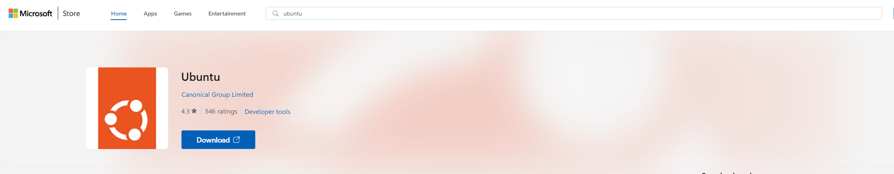
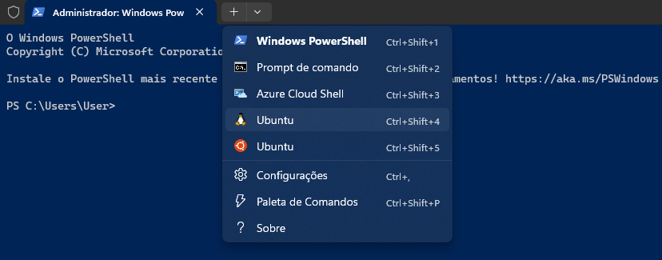
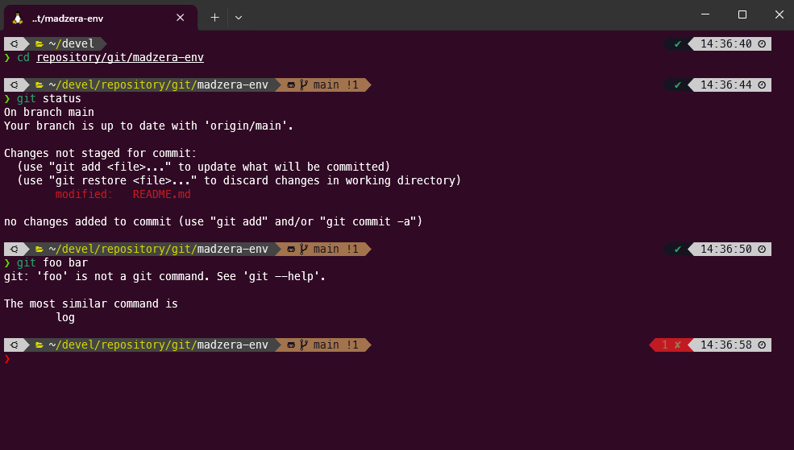
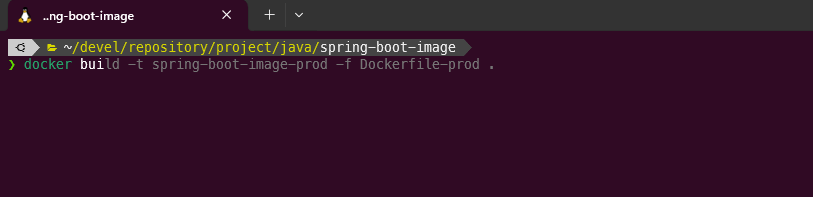
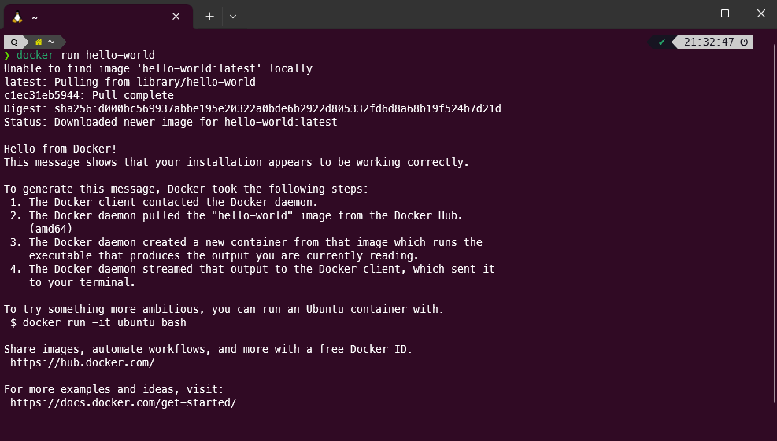
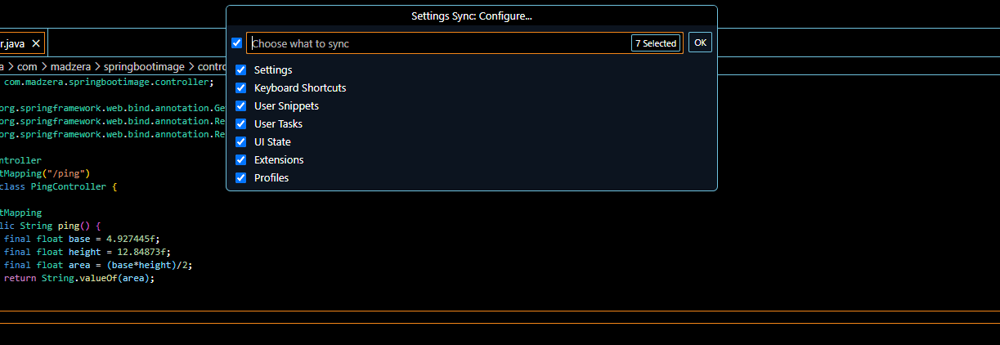
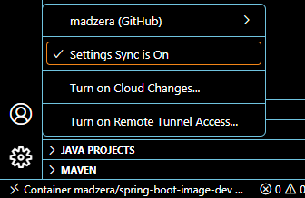
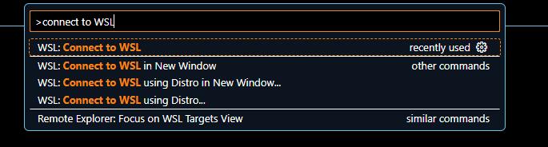
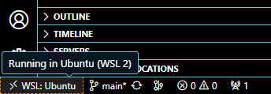

<p align="center">
  <a href="#" target="_blank" >
    
  </a>
</p>

“*A single and compacted development environment is like a minimalist apartment.*”

# About the MadZera Development Environment
This is a repository that represents my personal development environment. I try to gather all possible tools and software that assist the software development process into one place, compacted and extremely organized, thus avoiding the bureaucratic process of configuration every time there is a new machine or when I need to reinstall everything again for any reason.

My environment consists only into 4 parts:

| Sofftware | Description |
|---|---|
| OS  | WSL  |
| Shell  | Oh My Zsh  |
| Services  | Docker  |
| IDE  | Visual Studio Code  |

With those basic parts, I believe that my development environment turns extremely portable, as I could manage to get the best of both Windows & Linux features, also I have a customized terminal with Oh My Zsh and an "All-in-One" development utility inside of VSCode, including Docker containers.

In practical terms, when I am developing some stuff, I just do anything inside of VSCode, as it run under Remote WSL, with a customized Oh My Zsh Integrated terminal and for every 
development tools I just need of the vast plugins world that VSCode has to offer. In case I need a database, cache system, building tools, etc, I just use Docker.

“*My goal is installing the minimum stuffs as possible.*”

# WSL

For me, the best OS is neither Windows nor Linux. It's both, combined into one.
Nothing better than editing a document using Word, for example, and at the same machine using essential services like Docker inside of Windows. This combination makes the development process extremely efficient, as I could just alternate between Windows and Linux by only using ALT-TAB. With WSL it still becomes better because WSL is thought to interoperate files and commands in an easy way. Using a very usual example, if the user wants to run the Windows VSCode inside of Linux Terminal, it can be run by just typing `code` command.

The WSL evolved so much in the last years. The Linux becomes an extension of the Windows, inheriting environment variables from Windows, allowing the execution of some Windows utilities inside of the own Linux terminal, and being extremely fast, because it is not a default virtualization as it is for the VirtualBox, for instance. The WSL adopts the **para-virtualization** concept, not hijacking machine resources, but instead of that, those resources are shared for both OS, it means the Linux uses the resources in a volatile way, it is not fixed.

Another powerful advantage of using WSL is treating the system like a 'box', as you can store and take the system anywhere else. You can export and backup the current state of your system in a single *.tar* file and import this to another machine. Additionally, it is recommended to take periodic backups because you can recover your system when a failure occurs.

### Versions

| OS | Version |
|---|---|
| WSL Version  | 2  |
| Windows  | 11  |
| Linux Distro  | Ubuntu 22.04.3 LTS  |

### Installation

1. You can install WSL by using Microsoft Store or by command line:

	1.1 You can download the Ubuntu distro inside of Microsoft Store.
	
	
	1.2 Alternatively, you can run the following commands:
	
	- Update the WSL, to get the latest version: `wsl --update`
	- Guarantee that the Windows system is using the WSL version: `wsl --set-default-version 2`
	- Install Ubuntu default version (Ubuntu 22.04.3 LTS for the current date): `wsl --install`

2. After installation, you click to open then set your username and the *root* password for the *root* user. After that, you can close Command Prompt because we will work with the *Windows Terminal* instead.

3. Inside of Microsoft Store, also install the **Windows Terminal** (not mandatory, but recommended).
	
	
	3.1 You can use my preferences [`settings.json`](./1_wsl/settings.json) by importing the file.

	3.2 To import, paste the file inside of: ***%LocalAppData%\Packages\Microsoft.WindowsTerminal_8wekyb3d8bbwe\LocalState***

4. Verify if your installation was successfully installed. You just need to open a new tab inside your Windows Terminal:


Now your installation is ready. If you desire in the future to backup your entirely environment, run the command in Windows PowerShell to export your WSL in a *.tar* file:

- Stop the WSL before:
```bash
wsl --shutdown
```
- Export your current state of your WSL:
```bash
wsl --export <<IMAGE NAME>> <<TARGET FILE>>.tar
```

For importing, use:
```bash
wsl --import <<NEW IMAGE NAME>> <<SOURCE DIR FILE>> <<FILENAME>>.tar
```

### Configuration

As I said before, the Windows OS and WSL share the same resources from your machine. Howerver, you can determine the maximum resources the WSL can use. Those resources are related to CPUs cores, memory, and memory swap.

This configuration is determined by creating a file inside of your *USER HOME* directory of your Windows OS. The file must be named as `.wslconfig`.

**Do not forget to place this file in your Windows home directory**.

My WSL configuration uses 5 CPUs cores and 16GB of memory in a machine that has 64GB of memory with 10 CPUs core. In my opinion, using 8GB of memory is enough to run WSL, as your number of Docker images grows, you can configure WSL to use more resources.

Following, there is the code for the configuration example or, you can download my [`.wslconfig`](./1_wsl/.wslconfig):
```bash
	[wsl2]
	memory=8GB
	processors=2
	swap=1GB
```

# Oh My Zsh

Oh My Zsh is framework that works over the ZSH Shell. It allows you to style and customize your Shell to your liking, adding styles to your terminal, as well as helping you quite significantly when typing commands.

Oh My Zsh (ohmyzsh) runs over the ZSH Shell, which in turn is an abstraction of the Linux Bash, and Bash works over Linux SH (Linux Shell):

`sh > bash > zsh > ohmyzsh`

For who work too much with the command lines, this tool is essential to improve your efficiency. Below, some advantages using ohmyzsh:

- The output of commands becomes more informative and enjoyable. It shows up the location, whether the directory is a Git Repository and returns the result of the command:

-  If you work with Docker, a platform that its commands usually are long, the ohmyzsh improves your productivity, as it assists you to complete your long commands:

- If you want to list `git commit` commands, to see all your previous commentaries for instance, the ohmyzsh can store a history of your commands by pressing ↑. In that case, this will list all commands that start with `git commit`.

Those features, supported by the Oh My Zsh are so important, that I consider this tool essential to develop applications.

### Installation

To install this delightful terminal, you will need the ohmyzsh and a **powerlevel10k** plugin to customize the themes of your terminal.

#### Prerequisites

- `curl` or `wget` should be installed
- `git` should be installed (recommended v2.4.11 or higher)

#### ohmyzsh installation

You just need to execute the following command, depending on if had you used `curl`or `wget`:

| Method    | Command                                                                                           |
| :-------- | :------------------------------------------------------------------------------------------------ |
| **curl**  | `sh -c "$(curl -fsSL https://raw.githubusercontent.com/ohmyzsh/ohmyzsh/master/tools/install.sh)"` |
| **wget**  | `sh -c "$(wget -O- https://raw.githubusercontent.com/ohmyzsh/ohmyzsh/master/tools/install.sh)"`   |

#### ohmyzsh configuration

After installation, I recommend restarting Ubuntu by just closing the terminal window and reopening it again, then you will be able to see a `.zshrc`file in your Ubuntu user home directory. This file contains all metadata configuration of your shell, but there are two configuration that cannot be missing:

1. You must choice the plugin theme, and in this case, you should put:

	`ZSH_THEME="powerlevel10k/powerlevel10k"`

2. Define some important plugin in the file:

	`plugins=(git git-flow zsh-syntax-highlighting zsh-autosuggestions)`

The `.zshrc`file can have other purposes, such as I did it by defining some environments variables and configuring a toll called *asdf*, but it is not relevant for this tutorial.

If you want to use my `.zshrc` as template, you can find by clicking [here](./2_ohmyzsh/.zshrc). You just need to copy-paste to your user home directory. In that case, just do not forget to erase my own configurations that you don't use, like the environment variables and *asdf* config.

#### powerlevel10k installation

1. Run the following command:

```bash
git clone --depth=1 https://github.com/romkatv/powerlevel10k.git ${ZSH_CUSTOM:-$HOME/.oh-my-zsh/custom}/themes/powerlevel10k
```
2. Set `ZSH_THEME="powerlevel10k/powerlevel10k"` in `~/.zshrc` (mentioned above).

#### powerlevel10k configuration

1. Install new fonts from this [link](https://github.com/romkatv/powerlevel10k#meslo-nerd-font-patched-for-powerlevel10k), or download from [here](./2_ohmyzsh/fonts/). The fonts will make your environment more ergonomic.
2. You can configure the layout of your ohmyzsh by importing my configuration file inside your home directory or through prompt command:
	- You can use my *.p10k.zsh* configuration file. Just copy the [file](./2_ohmyzsh/.p10k.zsh) and paste inside your Ubuntu home directory.
	- To configure by prompt command and generating your own *.p10k.zsh* file, just run the command: `p10k configure`.
	- Then, choose your preferred styles: 

Now, you have a wonderful terminal, increasing your productivity drastically.

# Docker

Nowadays, Docker is crucial for developing applications. It is a service platform that para-virtualizes the essentials parts of a Linux Operative System providing only what your application needs and then puts all necessary stuffs in a container. For generating a container, you need to build an image and consequently, your image becomes portable, passive for exportation.

With Docker, the deploy application for production environment becomes uniform. This solves the situation where things work fine in the developer machine and not in the production environment. The execution environment of your application becomes a single environment, the same environment, the same container configuration defined in Docker image. This resolves all potential compatibility and application version issues that have been introduced within the container.

Additionally, you as a developer do not need to worry about the installation of tools like databases, server applications, etc. You just need to import the image of those tools.

There are two ways to install Docker inside Ubuntu distro, via Docker Desktop or Docker Engine. In this tutorial, I will focus only on the installation of Docker Engine, because it brings only what is necessary for the system, unlike the Docker Desktop. **Therefore, this section will only explain how to install the *Docker Engine* on Ubuntu**.

### Installation

Set up Docker's apt repository:

```bash
sudo apt-get update
sudo apt-get install ca-certificates curl
sudo install -m 0755 -d /etc/apt/keyrings
sudo curl -fsSL https://download.docker.com/linux/ubuntu/gpg -o /etc/apt/keyrings/docker.asc
sudo chmod a+r /etc/apt/keyrings/docker.asc

echo \
  "deb [arch=$(dpkg --print-architecture) signed-by=/etc/apt/keyrings/docker.asc] https://download.docker.com/linux/ubuntu \
  $(. /etc/os-release && echo "$VERSION_CODENAME") stable" | \
  sudo tee /etc/apt/sources.list.d/docker.list > /dev/null
sudo apt-get update
```

Install the latest version of Docker packages:

```bash
sudo apt-get install docker-ce docker-ce-cli containerd.io docker-buildx-plugin docker-compose-plugin
```

Verify if the installation has been successfully completed by running the command:

```bash
sudo docker run hello-world
```
Now, the output should be looks like: 


If you can see this, congratulations! We are almost there.

### Configuration

When Docker is installed, it runs as a service on Ubuntu, meaning Docker Service (a.k.a *Docker Daemon*) must be started before you execute any command from your Docker Client. For security reasons, Docker Daemon does not startup every time the Ubuntu initializes, because it has no permission to run as root-level, making you manually starting the Docker Daemon every time your system initializes and being necessary to run any Docker command with `sudo`. To avoid this, you can create a group for Docker to grant root-level permission, so you do not need to type `sudo` every time you input a command.

**Note: from this procedure, Docker will run as root privilege. So, take care about what sort of images will be built.**

Create the `docker` group:
```bash
sudo groupadd docker
```

Add your user to the `docker` group:
```bash
sudo usermod -aG docker $USER
```
Log out and log back in so that your group membership is re-evaluated. You can also run the following command to activate the changes to groups:
```bash
newgrp docker
```

Verify that you can run `docker` commands without `sudo`:
```bash
docker run hello-world
```

# Visual Studio Code

Technically, the VSCode is a text editor. This tool just born for the purpose of editing texts, initially without pretension to become what this tool is nowadays. Even though it is considered as a text editor, particularly, I consider VSCode an IDE, but not just any IDE, rather the best IDE. My consideration takes into account the fact that VSCode actually does all what other IDEs do, like:

- Real time compilation;
- Auto-completion assist;
- Debugging;
- Wonderful integration with software components (like databases, server applications, Git, Docker, Kubernetes etc.);
- Abundance of extras plugins;
- etc.

In my opinion VSCode could not be defined like a simple text editor precisely because the reasons mentioned above. But why do I consider the VSCode being the best IDE?

Answering this question, I can mention 3 reasons that made me to migrate from others IDE to use VSCode:

### Portable VSCode Settings

All settings configurated on your VSCode can be easily exported for the cloud, through your Microsoft or GitHub account. Everything that configures the workspace like hotkeys, general settings, profiles, plugins extensions, UI state, etc, can be saved and easily replaced again.

	
Moreover, VSCode allows settings to be automatically imported to another machine instantaneously, without needing any action. The developer simply doesn't have to waste time reconfiguring their entire environment again, nor copying and pasting folders for settings to be reinstated. This feature received the name of ***Settings Sync***

	
As you can see, I save my preferences into GitHub account. In my case, I usually use two machines and this feature simply is amazing for my situation.
	
### Plugins Extensions

VSCode is what it is nowadays thankfully the world and extensive number of plugins, more than that, the plugins made by official providers are simply amazing. This world of plugins allow the VSCode having the ability to do literally anything. For instance, I usually work with Java language, and in 30 seconds I am able to create a *Spring Boot* from inside of VSCode. I do not need to go to *Spring Initializr*, because the plugin *Spring Boot Tools* already does the work! But I mentioned only one plugin, I have a lot of them!
	
Every plugin extension has its associated ID. When you search for a plugin on VSCode by its name, on the page detail, the plugin ID is shown. The list of plugins that I've had installed (by ID) is [here](./3_vscode/extensions.txt).
	
### Remote Connection

Perhaps this is the feature that I consider most important of those all. This feature allows the developer to run his VSCode from Windows connected directly on WSL and Docker's containers.

#### WSL Connection

VSCode has the capability of running on Windows with its workspace pointed directly to the WSL instance, with no delay, as you should know that WSL is treated like another hard drive, how it would be beside Windows, however it is inside of it.
	
This feature allows me to work with Windows and Ubuntu at same time, using Windows apps like office and essentials tools for developing on Ubuntu, like Docker. And I can get it without using dual boot. That's why I prefer to work with WSL instead focusing in only one system.
	
The plugins that supports this feature is the **WSL** with the ID `ms-vscode-remote.remote-wsl`. After installing the plugin, connect to the WSL instance use the hotkey **ctrl + shift + p** and type *connect to WSL*:


Then confirm that VSCode had been connected with success to your WSL instance:


Now you can develop your applications using the Windows VSCode pointing to your Linux system.

#### Remote Container Connection

Besides the ability to directly connect to WSL from Windows, VSCode can delve even deeper into virtualization, at the level of containers. Easily, through the **Dev Containers** plugin (`ms-vscode-remote.remote-containers`), the VSCode workspace can be connected to a Docker container, either from an application image via Dockerfile or Docker-Compose, or simply through a container already running.

This way of developing applications is the ideal and most productive way, as it allows the developers to connect their VSCode directly to the respective container of the application they are working on and doesn't require them to install any software components on their computer, as everything will be configured within the container. Additionally, it allows the workspace environment to be uniform for all other developers within the same project.

The way I usually set up my VSCode workspace within a container is as follows:

- First, I run the container corresponding to my image.
- Next, using the DevContainers plugin, I attach my VSCode to the already running container.
- A new instance of VSCode will open with the project code pointing directly to the application code inside the container.
- I run the application.
- I make any changes to the code.
- The application is run again to confirm that the code changes are reflected.

https://github.com/madzera/madzera-env/assets/42177697/78e2e71e-d7ab-4c39-a0c4-522b4742f9e4

This approach shown in the video above has the major advantage of being extremely easy to connect the VSCode environment to the running container. The downside is that if your environment requires many plugins, it can be a bit frustrating to reinstall them, one by one, inside the container, since the plugins installed on your system do not automatically transfer into the container unless you configure them as a *Global Profile*, meaning all the VSCode plugins you set up as global become available every time the container is started. This is not ideal at all because there may be plugins that will not be used.

Alternatively to this way of developing applications linked to a running container, the Dev Containers plugin offers the possibility of automatically generating a Docker container from the image associated with your project. This container that will be started can be read from your **Dockerfile** or **docker-compose.yaml** file. When this approach is chosen, VSCode itself generates a file called **devcontainer.json**, in which the developer has the option to install extra tools inside the container. The major advantage of this approach is that the container can be fully configured all at once before its initialization, and this also includes VSCode plugins, as this file allows configuring the list of VSCode plugins that will be automatically installed inside the container every time it starts. The disadvantage of this approach is that it is a bit more complex and also more prone to issues during the container's initialization. This approach will not be explained in this document.

To know in detail about that, this is the [article](https://code.visualstudio.com/docs/devcontainers/containers) with full explanation.

## Extras Utilities

All the tools that have been shown in this document so far are the ones I consider essential to have a highly flexible, portable, and compact development environment. Now, in this section, I will present some tools that I usually use on Windows that are particularly valuable for specific situations:

| Utility | Objective |
|---|---|
| **Office++**  | For documentation. I use Word, OneNote and Excel to make the projects documentation.  |
| **Notepad++**  | Usually I use notepad++ to paste some long text content or when I need to format/minify JSON content through the **JSON Viewer Plugin**.  |
| **Postman**  | Even though I know that VSCode has a plugin with same intent, I prefer use Postman to call HTTP APIs.  |
| **Drawn.io**  | I use this utility to make most of diagrams. |
| **Typora**  | I use this utility to create/edit *.MD* files. This exact file was made using Typora. :)  |
| **Beyond Compare**  | This software compares text files content and folders structure.  |

on Linux, I use:

| Utility | Objective |
|---|---|
| **nvim**  | Text editor.  |
| **asdf**  | To manage every SDK runtime versions.  |

# Conclusion

In conclusion, it's easy to see that I strive to compress and make the most of what WSL with Ubuntu, OH My ZSH, Docker, and VSCode have to offer. These tools together are extremely powerful for application development, and I see few developers using this "combo".

In practice, I usually perform periodic backups of WSL every 2 months, and if any issues occur that require restoring the environment, or if I'm simply on a new machine, I just need to import the most recent WSL backup and everything is readily available, akin to a VM snapshot.

The keywords for this development environment I usually define as simple, compact, flexible, and portable. Everything a software developer needs to start their work regardless of the machine they are using.